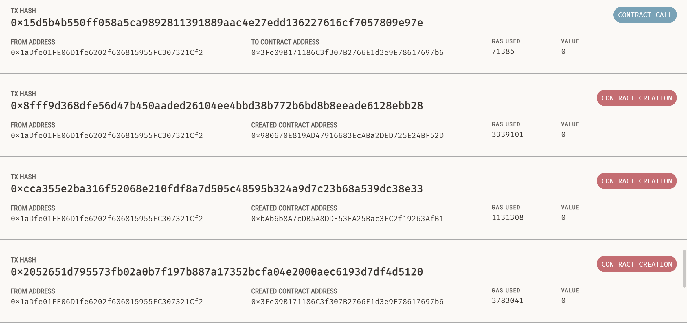
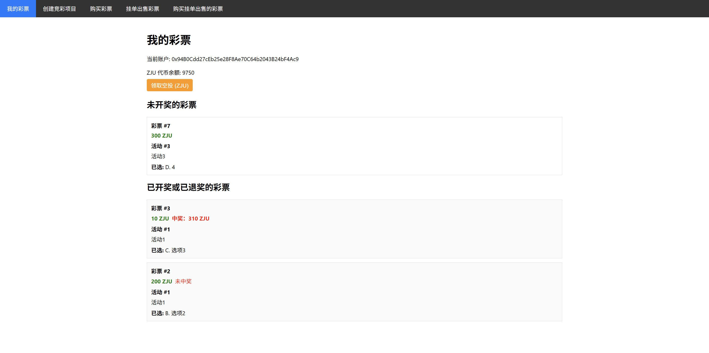
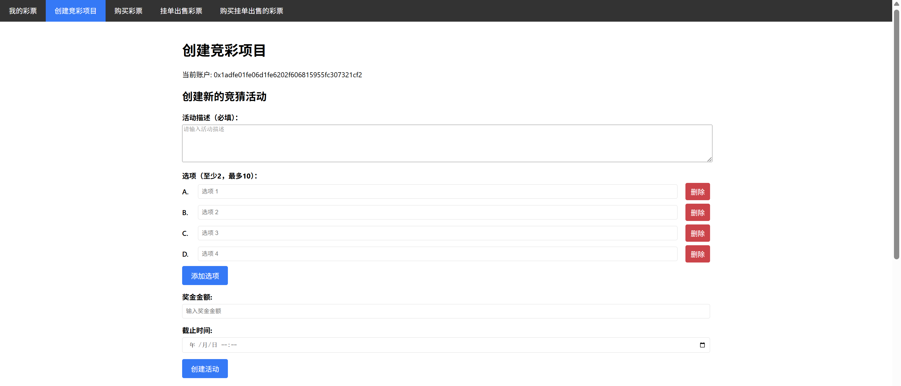
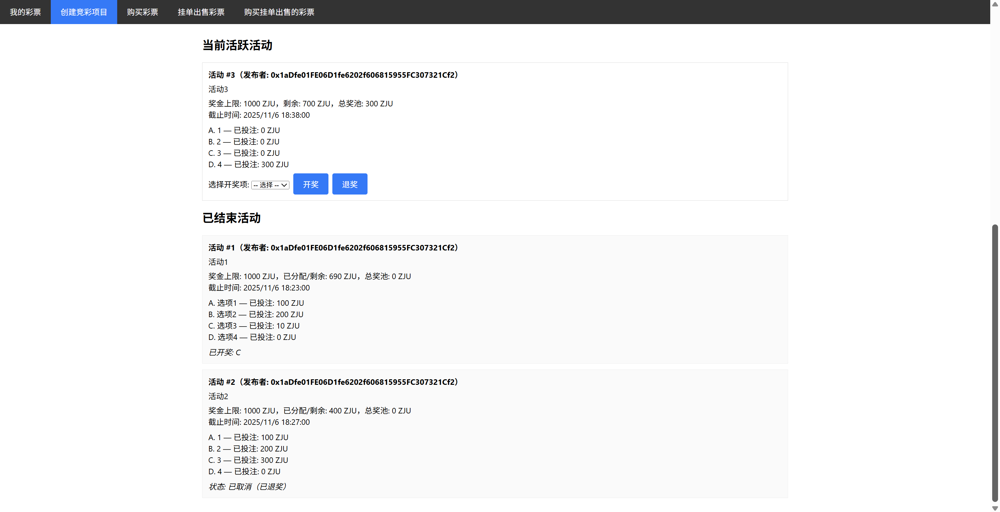
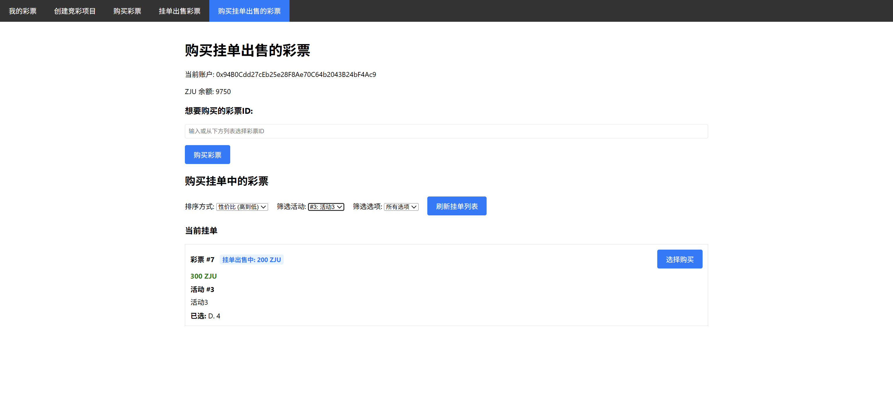

# ZJU-blockchain-2025-cyw

> **背景**：传统的体育彩票系统（例如我国的体育彩票）一般没有彩票交易功能：例如，对于“NBA本赛季MVP为某球员/F1的赛季总冠军为某车队”这类持续时间长的事件的下注一般在赛季开始前就会买定离手，这使得一旦出现突发或不确定事件（如球员A赛季报销/球队B买入强力球星/C车队车手受伤等），很多玩家的选择便会立即失去意义，导致彩票游戏的可玩性下降。因此，本实验将尝试实现一个进阶的去中心化彩票系统。

> 本项目实现了**发行 ERC20 合约（ZJU）**，允许用户领取 ERC20 积分，并使用 ERC20 积分完成上述流程。并且实现了**链上订单簿**：卖方用户可以以不同价格出售一种彩票，网页上显示当前订单簿的信息，买方用户可以筛选感兴趣的活动和选项对应的挂单出售中的彩票，还可以根据最优性价比（彩票面额/挂单出售金额）或者最低挂单出售金额对这些彩票排序，以便用最优的策略购买彩票。

> - **公证人**（你自己）：可以创立许多竞彩项目，每个项目应可以有2-10个选项，一定的彩票总金额（由公证人规定），以及规定好的结果公布时间。
> - **竞彩说明**：
>   1. 所有竞彩玩家可以从空投中领取到测试所需 **ERC20 积分**，即 **10000 ZJU 浙大币**。
>   2. 每个竞彩活动都由公证人定义了一个**总金额**，所有该活动彩票的积分总额**不能超过该总金额**。公证人可以在时间截止时随时终止活动：输入竞猜的结果并结算 或 退奖。活动结算时，**所有彩票的积分总额作为本次活动的奖池**，所有正确选项的彩票**按照面额比例瓜分**总奖池，如果没有任何人获奖（即正确选项无人购买），则该活动进行**退奖**，退还给彩票持有者相应面额的 ZJU 积分。
>   3. 每个竞彩玩家都可以选择其中的某个选项并购买一定金额（自主选择）的彩票，购买后该玩家会获得一张对应的彩票凭证（一个 ERC721 合约中的 Token）
>   4. 在竞彩结果公布之前，任何玩家之间可以买卖他们的彩票，以应对项目进行期间的任何突发状况。具体的买卖机制如下：一个玩家可以以指定的金额挂单出售自己的彩票，也可以随时取消挂单，其它玩家如果觉得该彩票有利可图就可以买入他的彩票。双方完成一次 ERC721 Token 交易。
> - **竞彩说明样例**：
>   1. 某活动有A/B/C三个选项，有三张彩票，Player1 持有 **A - 10 ZJU**，Player2 持有 **A - 20 ZJU**，Player3 持有 **B - 60 ZJU**。那么总奖池就是10+20+60=90 ZJU。如果开奖选项为 A ，则三位玩家分别获得 30/60/0 ZJU ；如果开奖选项为 C ，则无人选择正确答案，三位玩家分别获得 10/20/60 ZJU 。 
>   2. 任何的金额结算只和结算当时彩票的持有者有关：如果某活动发生开奖/退奖，所有对应活动下正在挂单出售的彩票默认未售出，直接结算给当前持有者，相应彩票也会取消挂单。另外，比如 Player1 购买 **A - 20 ZJU**，以 10 ZJU 的价格挂单出售，并由 Player2 购买，也就是 Player2 花费 10 ZJU 获得了一张面额 20 ZJU 的彩票。如果此时该活动发生退奖，Player2 将按照彩票面额获得 20 ZJU 的退奖。

## 如何运行

1. 在本地启动ganache应用。

2. 在 `./contracts` 中安装需要的依赖，运行如下的命令：
    ```bash
    npm install
    ```
3. 在 `./contracts` 中编译合约，运行如下的命令：
    ```bash
    npx hardhat compile
    ```
4. 打开 `./contracts/hardhat.config.ts` 文件，确认端口号与本地 Ganache 中的端口号一致（默认 8545），并且将 `accounts` 改为公证人的私钥。
5. 在 `./contracts` 中向 Ganache 部署合约，运行如下的命令：
    ```bash
    npx hardhat run scripts/deploy.ts --network ganache
    ```
    运行成功后，控制台会打印出合约地址，进入 `./frontend/src/utils/contract-addresses.json` 文件中，共有`LotteryNFT/MyERC20/EasyBet`三个合约地址需要设置，将对应的合约地址复制进去。
6. 进入 `./contracts/artifacts/contracts` 目录，在每一个合约的文件夹下找到 `.json` 后缀文件（注意不是 `.dbg.json` 后缀），将每个合约文件复制到 `./frontend/src/utils/abis` 文件夹下（复制进入前确保该文件夹已清空）。
7. 在 `./frontend` 中安装需要的依赖，运行如下的命令：
    ```bash
    npm install
    ```
8. 在 `./frontend` 中启动前端程序，运行如下的命令：
    ```bash
    npm run start
    ```

## 功能实现分析

1. 用户领取空投：在 `MyERC20.sol` 中实现了 `airdrop()` ，允许未领取过空投的用户领取空投。
2. 创建竞彩项目：在 `EasyBet.sol` 中实现了 `createActivity()` ，根据前端传来的活动描述、选项、总奖池和截止时间创建一个竞彩项目。
createActivity
3. 购买彩票：在 `EasyBet.sol` 中实现了 `buyTicket()` ，根据前端传来的活动编号、选项及购买价格铸造一个彩票（即一个ERC721合约）。
4. 结束竞彩项目：在 `EasyBet.sol` 中实现了 `settleActivity()` / `cancelActivity()`，可以设置选项并开奖，或者对活动进行退奖。无论以何种方式结束了竞彩项目，都会将正在挂单出售的彩票立刻结算给当前持有者，并将相应彩票从挂单交易平台中取下。
5. 挂单出售彩票/取消挂单：在 `LotteryNFT.sol` 中实现了 `listTicket()` / `delistTicket()`，根据前端传来的信息，将指定编号的彩票挂单出售或取消挂单。
6. 购买挂单出售中的彩票：在 `LotteryNFT.sol` 中实现了 `buyListedTicketWithERC20()` ，根据前端传来的代币类型和彩票编号，将指定编号的彩票从挂单交易平台上购买。
7. 筛选并排序挂单上的彩票：在 `LotteryNFT.sol` 中实现了 `getSortedAndFilteredTickets()` ，根据前端传来的筛选要求和排序选项，返回符合要求的彩票列表。

## 项目运行截图

1. 部署合约后，可以发现 Ganache 上有 3 条合约创建记录。


2. “我的彩票”界面，未开奖的彩票显示在上方，已开奖的显示在下方，并且会显示相应的中奖状态。


3. “创建项目”界面，可以增删选项，选择总金额以及开奖时间。


4. “创建项目”下方，还有当前活跃活动和已结束活动。管理员可以对当前活跃活动进行开奖或退奖操作。已结束活动会显示中奖选项或已退奖。


5. “挂单出售彩票”界面，可以选择自己持有的未开奖活动的彩票进行出售。


6. “购买挂单出售的彩票”界面，可以查看所有正在出售的彩票的挂单信息，并且可以根据活动进行筛选，根据性价比和出售价格进行排序。


## 参考内容

- 课程参考Demo：[DEMOs](https://github.com/LBruyne/blockchain-course-demos)。

- 快速实现 ERC721 和 ERC20：[模版](https://wizard.openzeppelin.com/#erc20)。
